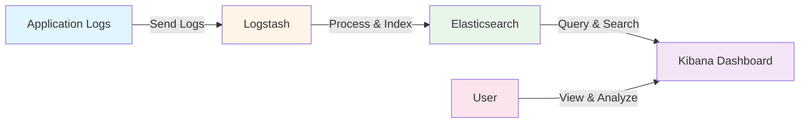
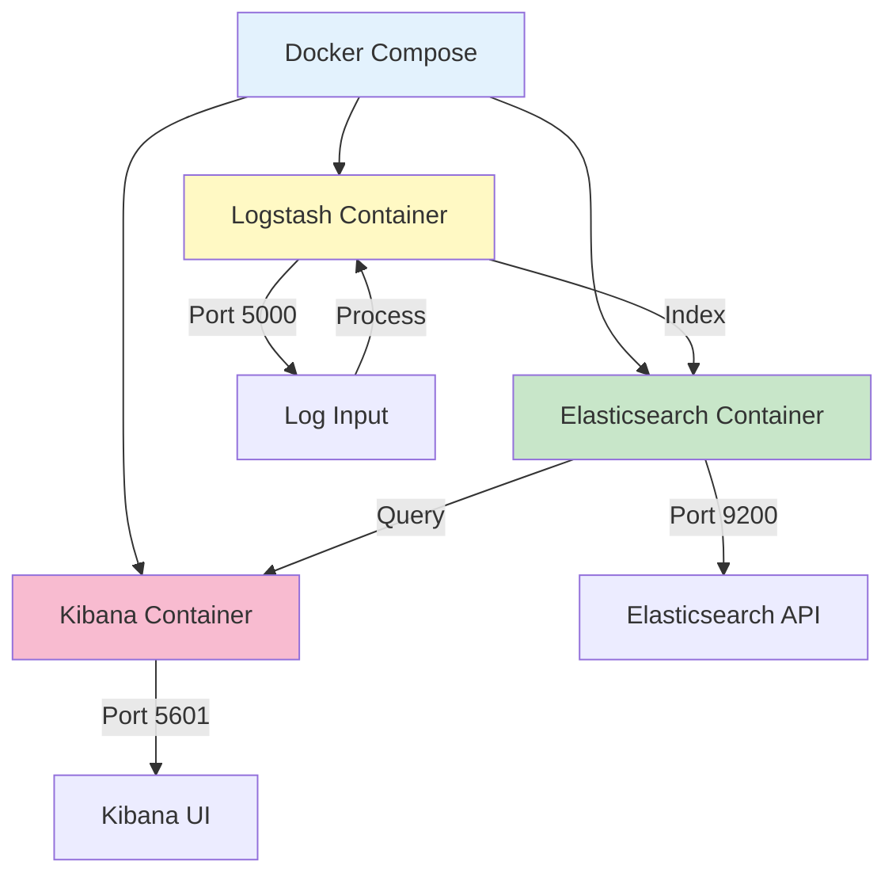
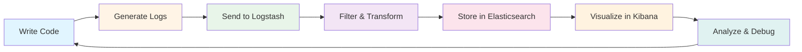

# Elasticsearch, Logstash, Kibana Learning

A curated collection of resources, examples, and projects to help learn and master the ELK Stack (Elasticsearch, Logstash, Kibana).

Built in April 2019. This repository contains practical examples and useful links for learning log management, search, and analytics using the Elastic Stack.

## Features

- 🐳 Docker-based ELK Stack setup for quick local deployment
- 📊 Node.js application example with ELK integration
- 🔗 Curated learning resources and tutorials
- 📝 Ready-to-use configuration files
- 🚀 Quick-start Docker Compose orchestration
- 📚 Reference implementations for common use cases

## What is the ELK Stack?

The ELK Stack is a collection of three open-source products:

- **Elasticsearch**: A distributed search and analytics engine
- **Logstash**: A server-side data processing pipeline that ingests, transforms, and sends data
- **Kibana**: A visualization layer that works on top of Elasticsearch

Together, they provide a powerful platform for searching, analyzing, and visualizing log data in real-time.

## Architecture



## Getting Started

### Prerequisites

- Docker and Docker Compose
- Node.js (v12 or higher) - for Node.js example
- At least 4GB of RAM available for Docker
- Basic understanding of Docker and logging

### Quick Start

1. Clone the repository:
```bash
git clone https://github.com/orassayag/elasticsearch-logstash-kibana-learning.git
cd elasticsearch-logstash-kibana-learning
```

2. Choose an example to run:

#### Option A: Docker ELK Stack
```bash
unzip docker-elk-master.zip
cd docker-elk-master
docker-compose up
```

#### Option B: Node.js with ELK
```bash
unzip node-elk-master.zip
cd node-elk-master
npm install
docker-compose up -d
node app.js
```

3. Access the services:
- **Kibana**: http://localhost:5601
- **Elasticsearch**: http://localhost:9200
- **Logstash**: Listening on port 5000

## What's Inside

### Docker ELK Example (`docker-elk-master.zip`)



A complete Docker-based ELK Stack with:
- Pre-configured Elasticsearch with proper settings
- Logstash pipeline for log processing
- Kibana dashboard ready for visualization
- Docker Compose for easy orchestration

### Node.js Example (`node-elk-master.zip`)

A practical Node.js application demonstrating:
- Winston logger integration
- Log shipping to Logstash
- Custom log formats
- Docker Compose setup for the entire stack

### Learning Resources (`misc/documents/links.txt`)

Curated collection of:
- Udemy courses on Elasticsearch
- GitHub repositories with examples
- Community projects and implementations

## Use Cases

- **Centralized Logging**: Collect logs from multiple applications
- **Application Monitoring**: Track application performance and errors
- **Security Analytics**: Analyze security events and threats
- **Business Intelligence**: Gain insights from application data
- **Debugging**: Search and analyze logs for troubleshooting

## Development Workflow



## Learning Path

1. **Beginner**: Start with Docker ELK example, explore Kibana UI
2. **Intermediate**: Run Node.js example, create custom dashboards
3. **Advanced**: Modify Logstash pipelines, optimize Elasticsearch indices

## Project Structure

```
elasticsearch-logstash-kibana-learning/
├── docker-elk-master.zip      # Complete ELK stack in Docker
├── node-elk-master.zip         # Node.js integration example
├── misc/
│   └── documents/
│       └── links.txt           # Learning resources
├── CONTRIBUTING.md             # Contribution guidelines
├── INSTRUCTIONS.md             # Detailed setup instructions
├── LICENSE                     # MIT License
├── README.md                   # This file
└── package.json                # Project metadata
```

## Contributing

Contributions to this project are [released](https://help.github.com/articles/github-terms-of-service/#6-contributions-under-repository-license) to the public under the [project's open source license](LICENSE).

Everyone is welcome to contribute. Contributing doesn't just mean submitting pull requests—there are many different ways to get involved, including answering questions and reporting issues.

Please feel free to contact me with any question, comment, pull-request, issue, or any other thing you have in mind.

## Additional Resources

- [Official Elastic Documentation](https://www.elastic.co/guide/)
- [Elasticsearch Guide](https://www.elastic.co/guide/en/elasticsearch/reference/current/index.html)
- [Logstash Guide](https://www.elastic.co/guide/en/logstash/current/index.html)
- [Kibana Guide](https://www.elastic.co/guide/en/kibana/current/index.html)

## Author

* **Or Assayag** - *Initial work* - [orassayag](https://github.com/orassayag)
* Or Assayag <orassayag@gmail.com>
* GitHub: https://github.com/orassayag
* StackOverflow: https://stackoverflow.com/users/4442606/or-assayag?tab=profile
* LinkedIn: https://linkedin.com/in/orassayag

## License

This project is licensed under the MIT License - see the [LICENSE](LICENSE) file for details.
