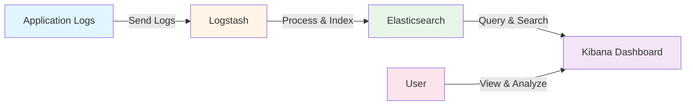
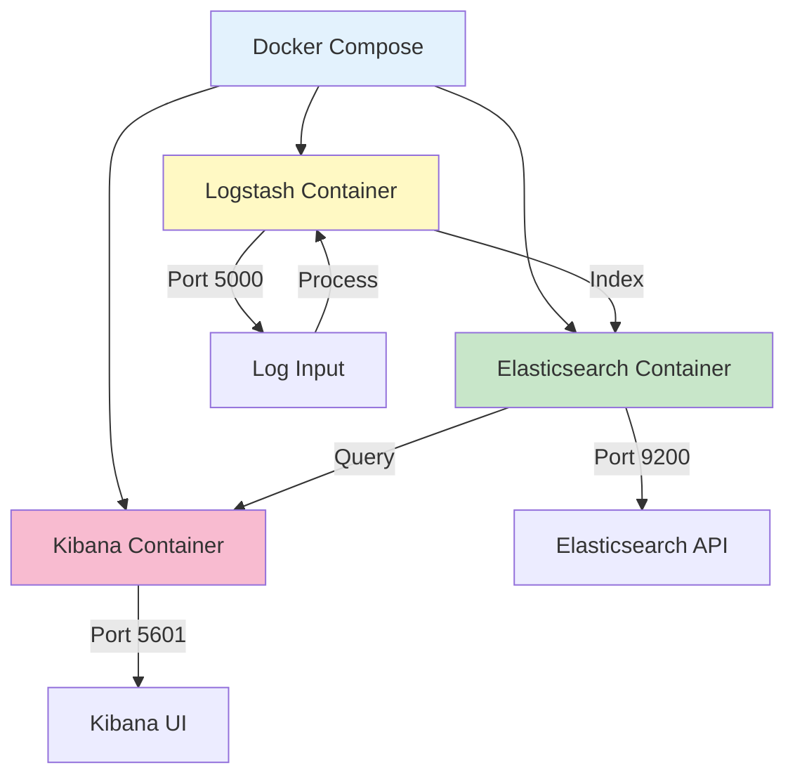
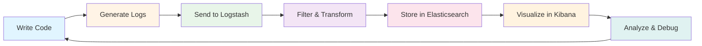

# Elasticsearch Logstash Kibana Learning

A hands-on learning repository for mastering the ELK Stack (Elasticsearch, Logstash, Kibana).

Built in April 2019, it includes Docker-based setups, Node.js integration examples, and practical log processing workflows. The project demonstrates how to ingest, transform, and visualize logs for monitoring, analytics, and debugging. It focuses on real-world observability use cases, quick local deployment, reusable configurations, and step-by-step examples to help developers build production-ready logging and search pipelines using the Elastic ecosystem.

## Features

- 🐳 Docker-based ELK Stack setup for quick local deployment
- 📊 Node.js application example with ELK integration
- 🔗 Curated learning resources and tutorials
- 📝 Ready-to-use configuration files
- 🚀 Quick-start Docker Compose orchestration
- 📚 Reference implementations for common use cases

### Core Capabilities

- **Docker-based ELK Stack**: Complete Elasticsearch, Logstash, and Kibana in containers
- **Node.js Integration**: Winston logger integration for application logging
- **Log Processing Pipeline**: Logstash configurations for transforming and enriching logs
- **Visualization Dashboards**: Kibana dashboards for monitoring and analytics
- **Quick Deployment**: Docker Compose for fast setup and teardown

### Technical Excellence

- **Containerization**: Docker and Docker Compose for consistent environments
- **Configuration as Code**: Reusable Logstash configurations
- **Documentation**: Comprehensive examples and learning resources
- **Best Practices**: Industry-standard logging and monitoring patterns

### Developer Experience

- **Quick Start Guides**: Step-by-step instructions for both Docker and Node.js examples
- **Learning Resources**: Curated tutorials and courses
- **Reference Implementations**: Working examples for common use cases
- **Clear Architecture**: Well-documented project structure

## What is the ELK Stack?

The ELK Stack is a collection of three open-source products:

- **Elasticsearch**: A distributed search and analytics engine
- **Logstash**: A server-side data processing pipeline that ingests, transforms, and sends data
- **Kibana**: A visualization layer that works on top of Elasticsearch

Together, they provide a powerful platform for searching, analyzing, and visualizing log data in real-time.

## Architecture



### Architecture Principles

This project follows clean architecture principles:

1. **Separation of Concerns**: Each component (Elasticsearch, Logstash, Kibana) has a clear purpose
2. **Configuration as Code**: All pipeline and stack configurations are version-controlled
3. **Portability**: Docker-based setup works across different environments
4. **Reusability**: Configurations and examples can be adapted to other projects
5. **Documentation**: Comprehensive documentation for all components and workflows

## Getting Started

### Prerequisites

- Docker and Docker Compose
- Node.js (v12 or higher) - for Node.js example
- At least 4GB of RAM available for Docker
- Basic understanding of Docker and logging

### Installation

1. Clone the repository:

```bash
git clone https://github.com/orassayag/elasticsearch-logstash-kibana-learning.git
cd elasticsearch-logstash-kibana-learning
```

2. Extract one of the example archives:

```bash
# For Docker ELK Stack example
unzip docker-elk-master.zip

# For Node.js with ELK example
unzip node-elk-master.zip
```

## Configuration

### Docker ELK Stack Configuration

The Docker ELK Stack example includes pre-configured:

- Elasticsearch settings (cluster name, memory limits)
- Logstash pipeline configurations (input, filter, output)
- Kibana dashboard definitions
- Docker Compose orchestration

Configuration files are located in the extracted `docker-elk-master/` directory.

### Node.js Example Configuration

The Node.js example includes:

- Winston logger configuration
- Logstash transport integration
- Custom log formatters
- Environment configuration

Configuration files are located in the extracted `node-elk-master/` directory.

## Usage

### Docker ELK Stack

```bash
cd docker-elk-master
docker-compose up
```

Access the services:

- **Elasticsearch**: http://localhost:9200
- **Kibana**: http://localhost:5601
- **Logstash**: Listening on port 5000

### Node.js with ELK

```bash
cd node-elk-master
npm install
docker-compose up -d
node app.js
```

## Available Scripts

### Docker ELK Stack Scripts

- `docker-compose up`: Start the ELK stack
- `docker-compose down`: Stop the ELK stack
- `docker-compose logs`: View stack logs

### Node.js Example Scripts

- `node app.js`: Start the Node.js application
- `npm start`: Start the application (if package.json is configured)

## What's Inside

### Docker ELK Example (`docker-elk-master.zip`)



A complete Docker-based ELK Stack with:

- Pre-configured Elasticsearch with proper settings
- Logstash pipeline for log processing
- Kibana dashboard ready for visualization
- Docker Compose for easy orchestration

### Node.js Example (`node-elk-master.zip`)

A practical Node.js application demonstrating:

- Winston logger integration
- Log shipping to Logstash
- Custom log formats
- Docker Compose setup for the entire stack

### Learning Resources (`misc/documents/links.txt`)

Curated collection of:

- Udemy courses on Elasticsearch
- GitHub repositories with examples
- Community projects and implementations

## Use Cases

- **Centralized Logging**: Collect logs from multiple applications
- **Application Monitoring**: Track application performance and errors
- **Security Analytics**: Analyze security events and threats
- **Business Intelligence**: Gain insights from application data
- **Debugging**: Search and analyze logs for troubleshooting

## Development Workflow



## Learning Path

1. **Beginner**: Start with Docker ELK example, explore Kibana UI
2. **Intermediate**: Run Node.js example, create custom dashboards
3. **Advanced**: Modify Logstash pipelines, optimize Elasticsearch indices

## Project Structure

```
elasticsearch-logstash-kibana-learning/
├── docker-elk-master.zip      # Complete ELK stack in Docker
├── node-elk-master.zip         # Node.js integration example
├── misc/
│   └── documents/
│       └── links.txt           # Learning resources
├── CONTRIBUTING.md             # Contribution guidelines
├── INSTRUCTIONS.md             # Detailed setup instructions
├── LICENSE                     # MIT License
├── README.md                   # This file
└── package.json                # Project metadata
```

### Directory Structure

```
elasticsearch-logstash-kibana-learning/
├── .github/                    # GitHub configuration
│   └── rulesets/               # Repository rules
├── .vscode/                    # VS Code settings
├── misc/                       # Miscellaneous files
│   └── documents/              # Documentation
│       └── links.txt           # Learning resources
├── CONTRIBUTING.md             # Contribution guidelines
├── INSTRUCTIONS.md             # Detailed instructions
├── LICENSE                     # License file
├── README.md                   # Project README
├── SECURITY.md                 # Security policy
└── docker-elk-master.zip       # Docker ELK example
└── node-elk-master.zip         # Node.js ELK example
```

### Design Patterns

- **Pipeline Pattern**: Logstash filter chains for processing logs
- **Containerization Pattern**: Docker for consistent environments
- **Configuration as Code**: Version-controlled stack and pipeline configurations
- **Observer Pattern**: Logging and monitoring workflows

## Best Practices

### Logging Best Practices

1. **Structured Logging**: Use JSON format for logs
2. **Log Levels**: Use appropriate log levels (debug, info, warn, error)
3. **Context**: Include relevant context in logs (timestamps, request IDs)
4. **Sensitive Data**: Avoid logging sensitive information
5. **Log Rotation**: Implement log rotation to manage disk space

### ELK Stack Best Practices

1. **Resource Allocation**: Allocate sufficient memory to Elasticsearch
2. **Index Management**: Use index templates and ILM (Index Lifecycle Management)
3. **Performance**: Optimize Logstash filters for performance
4. **Security**: Secure Elasticsearch and Kibana with authentication
5. **Monitoring**: Monitor the ELK stack itself

### Development Best Practices

1. **Local Testing**: Test configurations locally before production
2. **Version Control**: Keep all configurations in version control
3. **Documentation**: Document all custom configurations and pipelines
4. **Backup**: Regularly backup Elasticsearch data
5. **Testing**: Test log processing pipelines with sample data

## Contributing

Contributions to this project are [released](https://help.github.com/articles/github-terms-of-service/#6-contributions-under-repository-license) to the public under the [project's open source license](LICENSE).

Everyone is welcome to contribute. Contributing doesn't just mean submitting pull requests—there are many different ways to get involved, including answering questions and reporting issues.

Please feel free to contact me with any question, comment, pull-request, issue, or any other thing you have in mind.

## Support

For questions, issues, or contributions:

- **GitHub Issues**: [https://github.com/orassayag/elasticsearch-logstash-kibana-learning/issues](https://github.com/orassayag/elasticsearch-logstash-kibana-learning/issues)
- **Email**: orassayag@gmail.com

## Additional Resources

- [Official Elastic Documentation](https://www.elastic.co/guide/)
- [Elasticsearch Guide](https://www.elastic.co/guide/en/elasticsearch/reference/current/index.html)
- [Logstash Guide](https://www.elastic.co/guide/en/logstash/current/index.html)
- [Kibana Guide](https://www.elastic.co/guide/en/kibana/current/index.html)

## Author

- **Or Assayag** - _Initial work_ - [orassayag](https://github.com/orassayag)
- Or Assayag <orassayag@gmail.com>
- GitHub: https://github.com/orassayag
- StackOverflow: https://stackoverflow.com/users/4442606/or-assayag?tab=profile
- LinkedIn: https://linkedin.com/in/orassayag

## License

This application has an MIT license - see the [LICENSE](LICENSE) file for details.

## Acknowledgments

- Built for educational and research purposes
- Respects robots.txt and implements rate limiting
- Uses user-agent rotation to avoid detection
- Implements polite crawling practices
